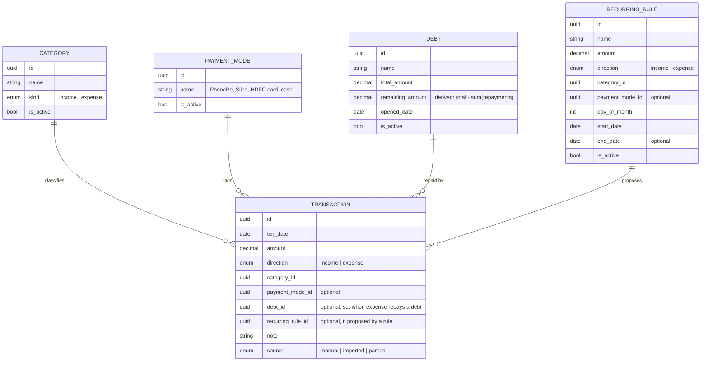

# Penny — Product Requirements Document (v1)

*A unified personal finance portal: track, visualise, and understand all your money through three simple ledgers — income, expenses, and debts — with a current-month analytics dashboard.*

**Owner:** Roshan **Status:** Draft for review **Currency:** ₹ INR **Users:** Single user (you)

---

## 1. Problem

Today, finances live in a flat Google Sheet of rows and columns. It works as a record but fails as a tool, in four connected ways:

1. **Fragmentation** — money moves through many modes (bank via PhonePe/UPI, Slice, cards, cash, person-to-person payments) and there is no single place that shows the whole picture.
2. **Repetitive entry** — fixed monthly expenses, subscriptions, and debt payments are re-typed every month.
3. **Debts are invisible** — there's no running view of what you still owe on a loan/EMI or how much you've already paid down.
4. **No insight** — no trends, no savings trajectory, no dashboard.

## 2. Goals & non-goals

**Goals (v1)**
- Three clean ledgers — **Income, Expense, Debt** — fully dynamic (add/edit/delete everything).
- Log a debt once with its total; pay it down month to month and always see the **remaining balance**.
- Reduce repetitive entry via recurring items and per-debt monthly payment lines.
- A current-month dashboard that answers "what came in, where it went, how much I saved, and how much I still owe" at a glance.
- Browse any previous month in the same dashboard layout.

**Non-goals (v1, revisit later)**
- Auto-capture (SMS/email/bank parsing) — designed-for but not built yet.
- Credit-card statement/due tracking as a dedicated feature (card bills are logged as ordinary expenses; see §4).
- Budgets/caps, savings goals, investment tracking, multi-user/family ledger, multi-currency, push notifications, debt finish-date projection.

## 3. Assumptions (confirm or correct)
- Currency is ₹ INR; single user; **visibility-first** (track & understand, not budget enforcement).
- Delivered as a **responsive web app (PWA)** — desktop dashboard + installable mobile quick-capture from one codebase.
- v1 is **manual entry**, but the data model carries a `source` field (`manual | imported | parsed`) so auto-capture is a future input into the *same* ledger, not a rewrite.
- **Payment mode** (PhonePe, Slice, card, cash…) is kept as an *optional* lightweight tag on each entry — no credit/due logic attached. *(Open: keep or drop — see §9.)*

---

## 4. Core concepts (the data model)

The design rests on three ledgers, plus a debt that you pay down through expenses.

| Concept | What it is | Why it matters |
|---|---|---|
| **Income** | Money coming in: salary, side income, transfers received. Date, amount, source/category, optional payment mode. | Feeds savings and trends. |
| **Expense** | Money going out, categorised. Date, amount, category, optional payment mode. May optionally be **linked to a Debt**, which makes it a repayment. | Drives the spending breakdown and trends. |
| **Debt** | A named liability ("debt commodity") with a **total amount** and a **remaining balance**. Paid down by expenses linked to it; appears in each month's expense entry until cleared. | Answers "how much do I still owe?" |
| **Category** | Income/expense bucket (Rent, Food, Shopping, Transport, Subscriptions, Debt repayment…). User-managed. | Drives breakdown and trend charts. |
| **Payment mode** *(optional)* | How you paid: PhonePe, Slice, a card, cash, etc. A simple tag — no statement/due logic. | Lets you see totals per mode. |
| **Recurring rule** | A fixed monthly income/expense (rent, salary, subscription) defined once. | Ends repetitive typing. |

### How a debt works (the key mechanic)
You create a debt **once** with its total, and from then on it shows up in every month's expense entry as a payable line you fill in:

> Create debt **Phone EMI**, total **₹84,000**. Each month it appears in your expense entry. In June you enter **₹7,500** against it → Penny records a **₹7,500 expense** (categorised, e.g. "Debt repayment") *and* reduces Phone EMI's remaining from **₹84,000 → ₹76,500**. Pay variable amounts month to month until remaining reaches **₹0**, at which point the debt is marked **cleared** and drops off the active list.

- **Remaining balance** = total − sum of all linked repayments (floored at ₹0; overpayment is flagged, not silently absorbed).
- Penny shows **remaining / total** and **% paid** per debt. Because payments are variable, it does **not** project a fixed finish date in v1 (a rough estimate from your recent average payment is a v2 nice-to-have).
- A debt repayment is a normal expense, so it counts in your spending and savings like any other outflow — no separate accounting.

### One number, one moment
Every entry is logged **when money actually moves** (you record what you *paid*, not what you *charged*). So spending and cash-out happen at the same time, and **savings = income − expenses** for the month, cleanly. *(This is why the earlier accrual-vs-cash-flow split is gone.)*

> *Avoid double-counting card/Slice spends:* log a spend **once** — either each purchase as it happens (tagged with that payment mode), or the monthly bill as a single expense, but not both. Logging the bill as one lump is simplest but loses per-category detail; your call per habit.

---

## 5. Features

### 5.1 Quick capture — income & expense
- Add an entry in ~3 taps: **amount → category → (optional) payment mode**, plus optional note and date (defaults today).
- An expense can optionally be **linked to a debt**, turning it into a repayment that reduces that debt's remaining balance.
- Edit/delete any entry; full searchable, filterable list per month.

### 5.2 Debts (dynamic CRUD)
- Create a debt with a **name** and **total amount**; edit or archive anytime.
- Every active debt surfaces in each month's expense entry as a **payable line** — enter what you paid this month and it posts a linked expense and reduces remaining.
- Per-debt view: **remaining / total**, **% paid**, payment history. Cleared automatically when remaining hits ₹0.

### 5.3 Recurring rules
- Define fixed income/expenses (rent, salary, subscriptions) once with amount, category, optional payment mode, and day-of-month.
- **Confirm inbox (v1 behaviour):** on the due day, each recurring item — and each active debt's monthly line — is **proposed** rather than posted silently. You approve (or edit the amount) with one tap and it lands in the ledger. Kills the repetitive typing while keeping you in control.

### 5.4 Categories & payment modes
- Both are dynamic, user-managed lists (add/edit/archive). Archiving preserves history; nothing is hard-deleted.

### 5.5 Dashboard — current month (home)
The landing screen, leading with current-month stats:
- **Hero:** **Saved this month** = Income − Expenses, with **savings rate %** and delta vs. last month.
- **Expense breakdown** by category (donut + ranked list).
- **Income** total and by source.
- **Debts panel:** total still owed across all active debts, each with remaining / total and a progress bar ("Phone EMI ₹76,500 left of ₹84,000 · 9% paid"). In-app only.
- **Upcoming & confirm inbox:** recurring items and this month's debt lines awaiting your one-tap entry/approval.

### 5.6 Trends & reports
- Month-over-month **line charts** for income, expenses, and savings (last 6–12 months).
- Per-month and cross-month **category trends**; optional total-debt-remaining trend.
- Monthly summary report; CSV export in v1, richer export later.

### 5.7 Navigation
- **Side menu** with a **month switcher**: current month plus clickable previous months, each loading the same dashboard layout for that period.
- Side menu also links to: Debts · Recurring · Categories · Payment modes · Reports · Settings.

---

## 6. Key user journeys

1. **Add a debt once.** Debts → New → "Phone EMI", total ₹84,000 → save. It now appears in every month's expense entry.
2. **Pay it down.** This month, enter ₹7,500 against Phone EMI → a ₹7,500 expense is logged and remaining drops ₹84,000 → ₹76,500. The Debts panel updates instantly.
3. **Everyday expense.** Quick-add ₹250 → "Food" → PhonePe. Flows straight into the month's spending.
4. **Log income.** Quick-add salary → "Salary" → bank. Hero savings recalculates.
5. **Review & switch months.** Open app → current-month dashboard → side menu → tap "May 2026" → identical dashboard scoped to May.

---

## 7. Suggested architecture (since you're also building it)
- **Frontend:** React PWA (installable, responsive) — single codebase for desktop + mobile.
- **Backend:** FastAPI.
- **Primary store:** PostgreSQL — transactions, debts, categories, payment modes, and recurring rules are cleanly relational; remaining balances and monthly aggregates come from views/queries. (MongoDB not needed for v1; a natural home later for raw parsed-SMS payloads in the auto-capture phase.)
- **Packaging:** Docker; `uv` for Python deps.
- Derived values (debt remaining, savings, per-mode totals) computed server-side so the same numbers back both the dashboard and any future export.

## 8. Roadmap
- **v1:** income/expense quick capture, debts with monthly repayment lines, recurring confirm inbox, dynamic categories + payment modes, current-month dashboard (savings, breakdown, debts panel), trends, month switching, CSV export, single user, INR, manual entry.
- **v2+:** auto-capture (SMS/email parsing → confirm inbox), due-date reminders/notifications, budgets & alerts, savings goals, investment & net-worth tracking, multi-currency, shared/family ledger, debt finish-date projection.

## 9. Locked decisions (v1)
- **D1 — Savings basis:** **cash flow** — savings = income − expenses for the month. Now unambiguous, since every entry is logged when money actually moves.
- **D2 — Recurring & debt posting:** **confirm inbox** — recurring items and monthly debt lines are proposed on their day and post only on one-tap approval. No silent auto-posting.
- **D3 — Budgets:** **strictly tracking** — no caps, targets, or alerts in v1.
- **D4 — Reminders:** **in-app only** — surfaced on the dashboard's Debts and Upcoming panels; no push notifications in v1.
- **D5 — No EMI/loan/credit-card engine:** these are modeled simply — **finite debts as Debt commodities**, **credit-card bills as ordinary expenses**. No statement dates, due dates, credit limits, or installment projections in v1.

## 10. Open
- **Payment mode tag:** keep it as an optional label (serves "see spending per app/card") or drop it entirely for maximum simplicity?